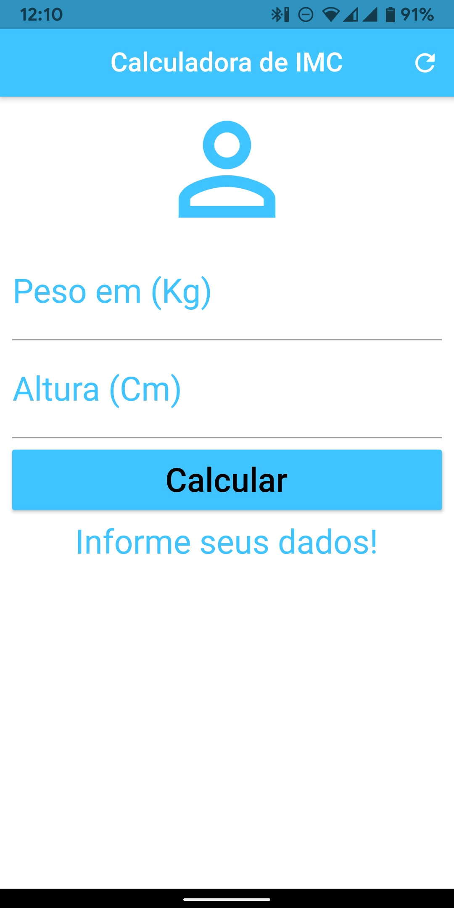
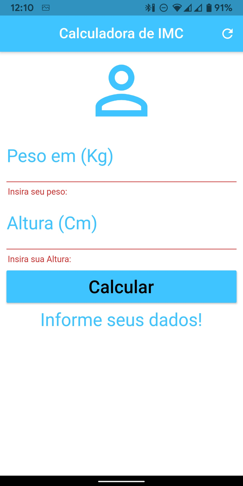
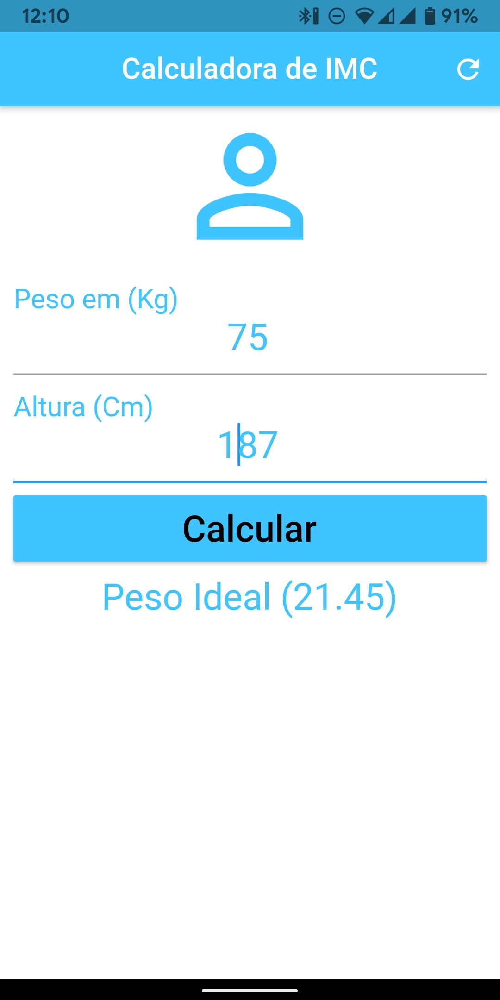

# Calculadora de IMC

Um sim aplicativo feito em flutter para calcular o IMC.
Para a construção desse projeto segui as orientações do curso da Udemy "Criação de Apps Android/iOS/Web com Flutter - 4 cursos em 1"

## 🖼️ Imagens

 

    
    
    
 

### ⚙ Features

- [x] Calcular IMC
- [x] Informar se está no Peso ideal, sobrepeso ou obesidade

### 📦 Pacotes

- [armeabi_v7a](https://github.com/fabriciolima77/calculadora_imc/blob/master/APK/app-armeabi-v7a-release.apk)

### 🛠 Tecnologias

As seguintes ferramentas foram usadas na construção do projeto:

- [Dart](https://dart.dev/)
- [Flutter](https://flutter.dev/)